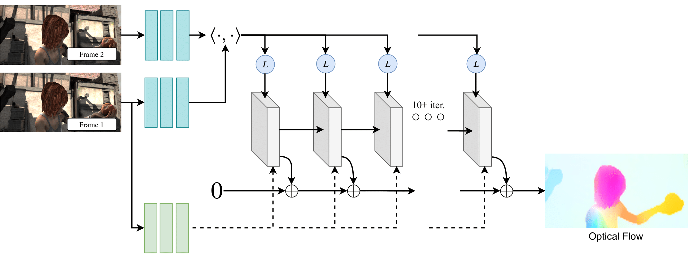

# RAFT
This repository contains the code for generating optical flows given an image sequence.

The repo is based on following paper:
[RAFT: Recurrent All Pairs Field Transforms for Optical Flow](https://arxiv.org/pdf/2003.12039.pdf)<br/>
ECCV 2020 <br/>
Zachary Teed and Jia Deng<br/>



## Requirements
Docker needs to be installed on your system. Images in the image sequence should have a flat structure and named as 1.png, 2.png, ...., 100.png and so on.

## How to use
From project root, run the following to build the image:

```
docker build -t raft .
```

And then run the following to run the container:

```
docker run -e MODEL_PATH=models/raft-kitti.pth -e DATASET_PATH=/datasets -e OUTPUT_PATH=/output -v <dataset_path_in_host>:/datasets -v <output_path_in_host>:/output --gpus all raft
```

`output_path_in_host` should exist beforehand. It will not be created automatically.

## Credit

A large portion of this code is taken from [Raft Official Repository](https://github.com/princeton-vl/RAFT)

